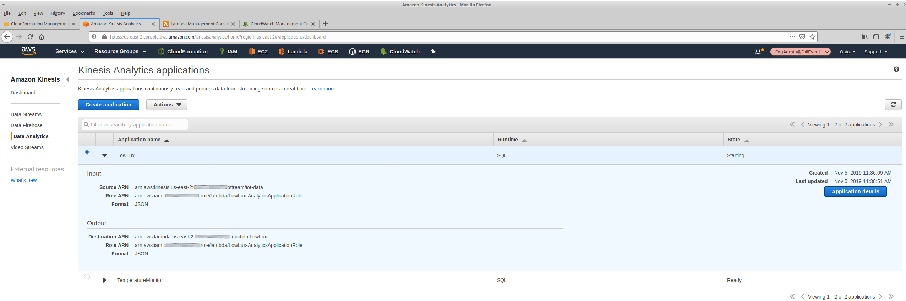
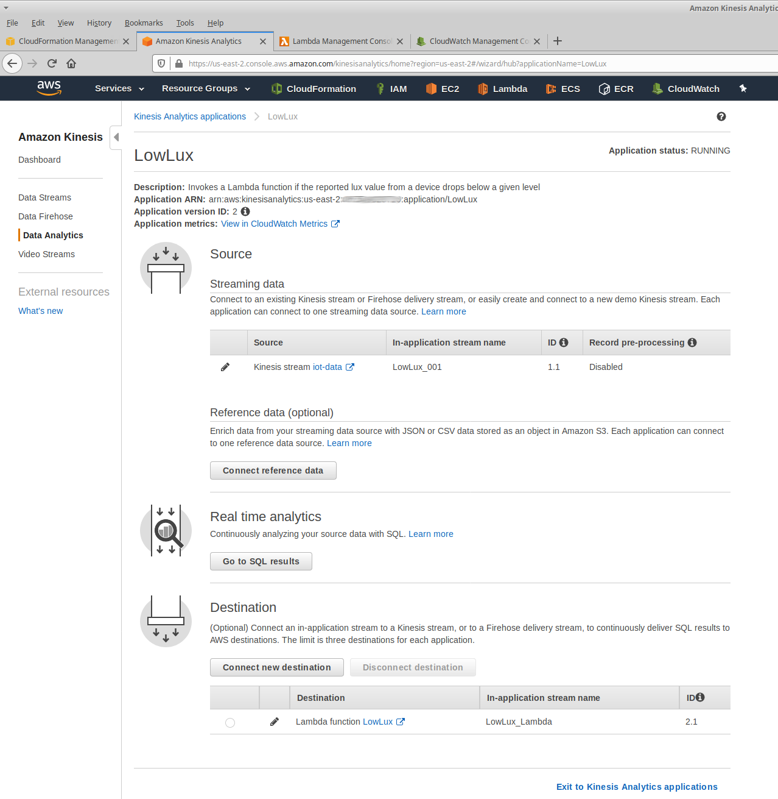
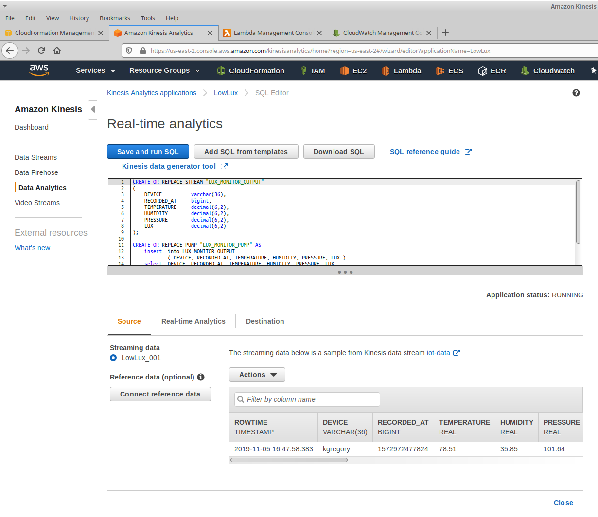
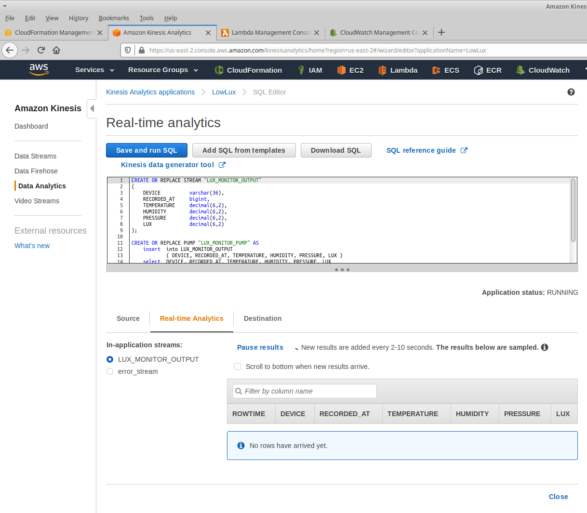
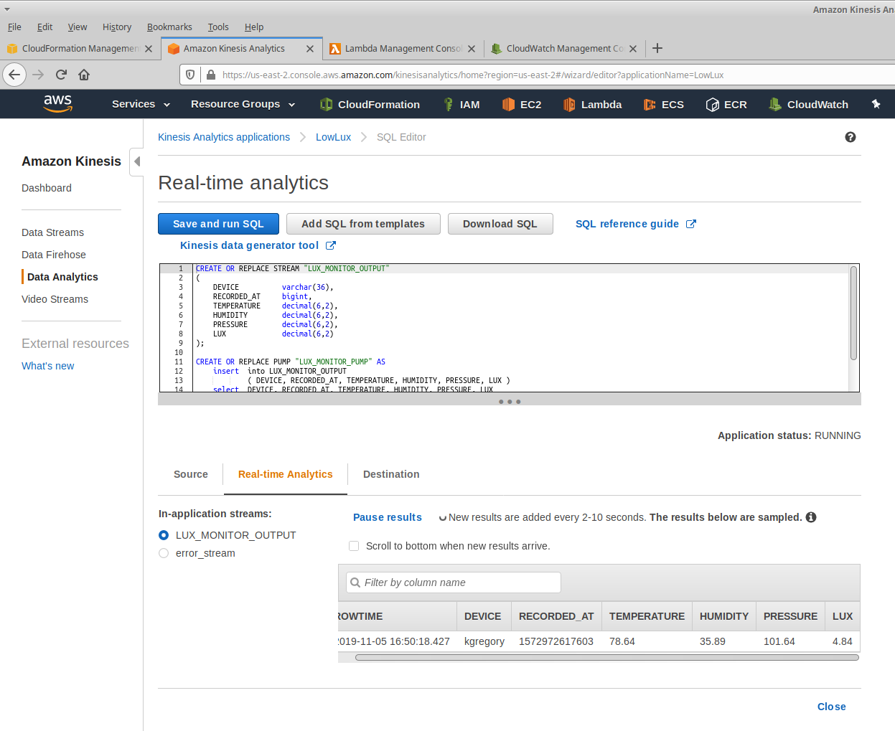
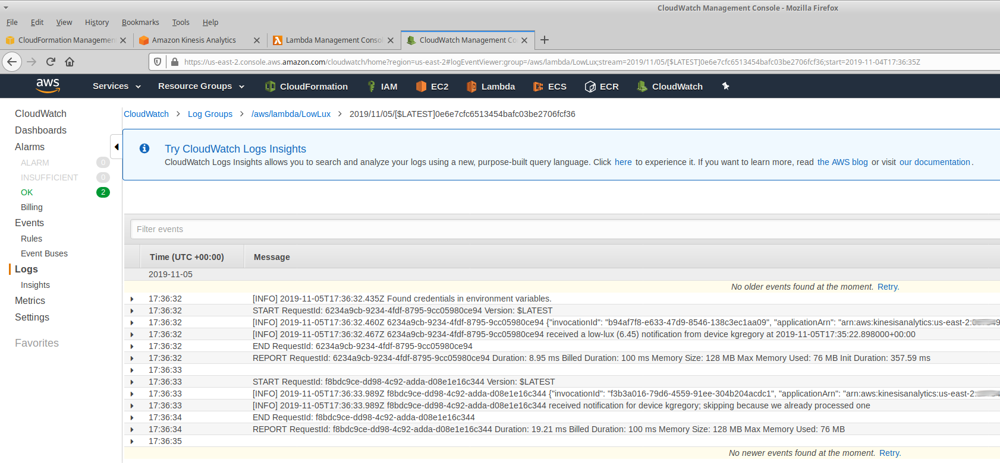

# Kinesis Analytics Example

This example uses a [Kinesis Analytics](https://docs.aws.amazon.com/kinesisanalytics/latest/dev/how-it-works.html)
application that invokes a Lambda when it sees records with a low lux value. This Lambda then sends a message to
SNS, which is (by default) hooked up to your email address.

## Getting Started

There's a [CloudFormation script](cloudformation.yml) that will create the Kinesis application (but see below for
caveats). It has the following parameters:

* `BaseName`  
  This is a name used to prefix all resources created by the stack.

* `LuxThreshold`  
  The lux level that will trigger a notification.

* `SourceStream`  
  The name of a Kinesis stream containing temperature readings. Defaults to the stream created for this workshop.

* `DestinationEmail`  
  An email address that will receive notifications. This has no default; you'll need to enter your email address.

## Running

When CloudFormation creates a Kinesis Analytics application, it is in the "Ready" state. To start it, you have
to go to the [AWS Console](https://console.aws.amazon.com/kinesisanalytics/home), select the application, and
choose the "Start Application" action.

Next, verify that the application is receiving data:

1.  Open the application by clicking on its name and then clicking the "Application Details" button.
    
2.  Click on the "Go to SQL results" button.
    
3.  It will take 20-30 seconds, but you will see a sampling of rows from your source data.
    

Then, trigger some output:

1.  Click on the "Real-time Analytics" tag. After 20-30 seconds you'll see an empty data table, and
    the message that no rows have arrived yet.
    
2.  Hold your finger over the light sensor for 20-30 seconds, and you should see results that show
    a lux value under the threshold.
    
3.  Open the [CloudWatch Logs](https://console.aws.amazon.com/cloudwatch/home?#logs:) group for your
    Lambda function, and verify that messages have been written to the logs.
    
    If you _don't_ see this, you will need to re-create the destination (see "gotcha" below).
4.  Verify that you've received an email.

## Caveats and Gotchas

SNS requires you to confirm that you want to receive notifications. Once you create your stack, you'll
receive an email with a confirmation link. Click that link or you won't see any notifications.

The name of a Kinesis Analytics stream is limited ot 32 characters. Since we create stream names based
on the "base name" provided as a CloudFormation parameter, a long name will cause stack creation failure.

We have seen cases where the application as created by CloudFormation does not send results to Lambda.
Disconnecting the destination and then reconnecting _after the application has been started_ appears to
solve this issue.

We have also seen the case where data continues to be sent long after the application has been deleted.
This is primarily an issue when you're doing development, and re-creating the same application.
